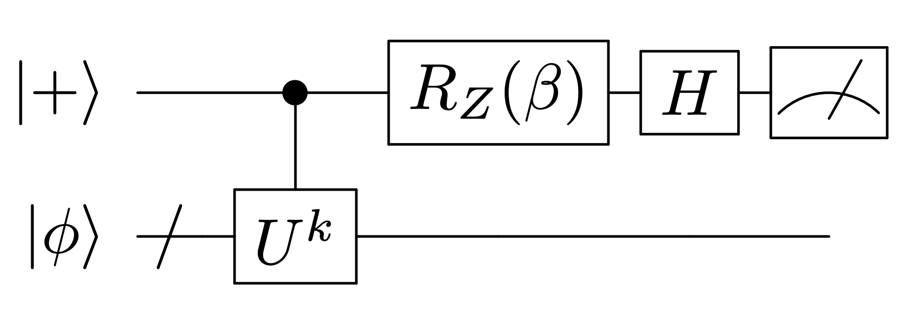
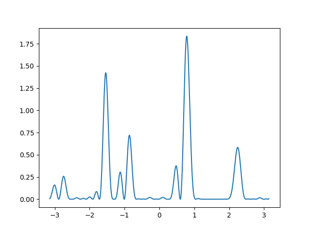

# phayes

`phayes` is a python package for easy and efficient quantum phase estimation.

Extensive details on Bayesian quantum phase estimation can be found in the accompanying paper, [Yamamoto et al, 2023](https://arxiv.org/abs/2306.16608).




Quantum phase estimation
[Wiebe et al, 2015](https://arxiv.org/abs/1508.00869),
[O'Brien et al, 2018](https://iopscience.iop.org/article/10.1088/1367-2630/aafb8e/pdf),
[van den Berg, 2021](https://quantum-journal.org/papers/q-2021-06-07-469/pdf/) (and 
quantum amplitude estimation [Suzuki et al, 2019](https://arxiv.org/abs/1904.10246)) can be implemented as an instance of Bayesian inference. Shots are generated from a quantum circuit with likelihood
$$p(m \mid \phi, k, \beta) = \frac12\left(1 + (1 - q)\cos(k\phi + \beta - m \pi)\right),$$
where $m \in \{0,1\}$ is the binary _shot_ produced by the quantum device, $\phi$ is the unknown underlying _phase_, $q$ is a noise parameter or error rate. $k$ and $\beta$ are circuit parameters that are chosen by the user (or `phayes`).

Starting with a uniform prior over $\phi$, `phayes` uses Bayesian inference to hone in on the true value (with uncertainty quantification) through repeated measurements.


## Install

```
pip install phayes
```

## Bayesian updates

The core functions are `phayes.get_k_and_beta` and `phayes.update`, which determine the experiment parameters and then update the posterior distribution in light of a new measurement (or series of measurements)

```python
from jax import numpy as jnp
import phayes

num_shots = 100

posterior_state = phayes.init()
for _ in range(num_shots):
    k, beta = phayes.get_k_and_beta(posterior_state)
    m = get_shot(k, beta)
    posterior_state = phayes.update(posterior_state, m, k, beta)
```
Here the function `get_shot` executes the quantum circuit above and returns a binary shot (or multiple shots) according the likelihood $p(m\mid \phi, k, \beta)$.


## There's more

The probability density function can be visualised easily

```python
prior_state = phayes.init()
m = jnp.array([0, 1, 1, 0, 0, 1])
k = jnp.array([1, 4, 3, 8, 5, 10])
beta = jnp.array([1.4, 0.6, 1.2, 1.1, 1.9, 0.3])

posterior_state = phayes.update(prior_state, m, k, beta)

import matplotlib.pyplot as plt
linsp = jnp.linspace(-jnp.pi, jnp.pi, 1000)
pdf = phayes.pdf(linsp, posterior_state)
plt.plot(linsp, pdf)
```




`phayes` also has a host of other useful functions

```python
posterior_mean = phayes.circular_mean(posterior_state)
posterior_circular_variance = phayes.circular_variance(posterior_state)
posterior_holevo_variance = phayes.holevo_variance(posterior_state)
```

Example notebooks can be found in the [examples](examples) folder.


## Precision

By default [JAX uses 32-bit precision](https://jax.readthedocs.io/en/latest/notebooks/Common_Gotchas_in_JAX.html#double-64bit-precision), 
for phase estimation experiments you may well want to enable 64-bit precision by 
adding the following to the top of your script
```python
from jax.config import config
config.update(“jax_enable_x64”, True)
```


## Citation

```
@software{phayes,
author={Duffield, Samuel},
title={phayes: A python package for easy and efficient Bayesian quantum phase estimation},
year={2023},
url={https://github.com/CQCL/phayes}
}
```
